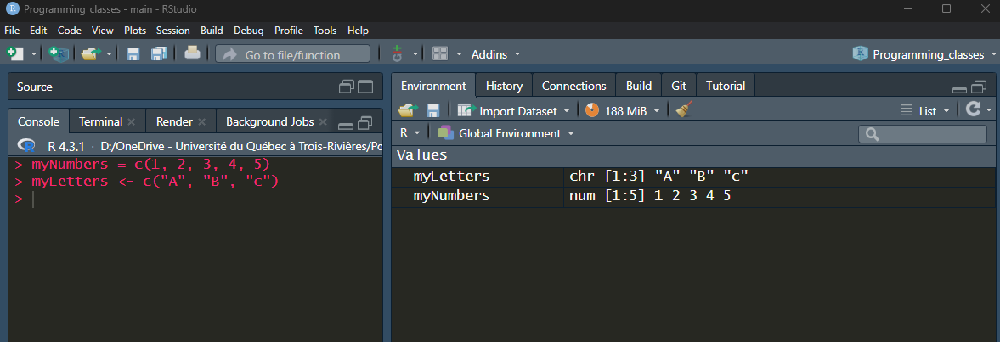

<style>
a {color: red}

h1, h2, h3 { color: blue}

</style>


## Variables

To work with your files, create new data and work with it, etc., you will want to save your things into R's memory. These things are variables. 

Every person you know is stored in your brain as a variable (their names); every contact in your cellphone is a variable that stores their names, phone number, email, etc.

## Variables - save your things in R

How to create a variable in R:

- Start with the name you want
- Use `=` or `<-` to separate the name from the value you want it to store

{width=100%}

## Variable names

- Cannot start with numbers
- Cannot have symbols, eg. `*(),\/"';:<>{}[]~!@#$%^+=`
- Cannot have space

> - Give variables meaningful names, you do not know who will need to look at your scripts or when you will go back to them


```{r echo=FALSE, message=FALSE, warning=FALSE, results='asis'}
library(tidyverse)
badNames = c("x, y, z, counts", "bacteriacountsforday5", "microplate")
goodNames = c("rawCountsRNAseq, fluorescenceTableDay1", "bacteriaCountsForDay5", "microplateFluorescence, microplateConcentration, microplateOD")
explanation = c("x, y, z don't tell us what the data there has, so you will not know later what you used",
		"Could be a good name, but is difficult to read, use upper and lower case or _ to improve readability",
		"Does not tell what kind of data is stored")

data.frame(badNames, explanation, goodNames) %>%
	kableExtra::kable(format = "html", 
			  col.names = c("Bad names", "Why?", "Good names")) %>% 
	kableExtra::kable_classic()

```

## Functions - work with your data

You use R to do something with your data:

- Calculate stats, eg. mean, standard deviation
- Know if two or more groups are different with T-test or ANOVA. 

> - You do these things using functions.<br>
They are simply a bunch of code stored in a variable with an specific name.<br>
You use them by typing the **name** followed by **`()`**. <br>
Most of the time, you need to put something inside the `()`, eg. a table, a column in a table, several numbers, etc. 

> - If you do not know how to use a function, ask for help (which is also a function!):

> - `help("mean")` or `?mean` will open a page in your browser (if you are using R) or the tab "Help" (if you are using RStudio) with an explanation of what the function does and how to use it

## Functions - examples

You load files into R using functions: `read.delim()`, `read.csv()`, `read_csv()` (this is different to the previous one)

- Eg. myFile.txt is in the "Input" folder of my project, it is a table with column names (headers) and row names, the columns are separated by tabs (`"\t"`)<br>`myFile <- read.delim(file = "Input/myFile.txt", header = T, row.names = 1)`
	1. `"Input/myFile.txt"` = where the file is stored, has to be inside `"` or `'`
	2. `header = T` or `header = TRUE` are the same thing, but all CAPS always
	3. `row.names = 1` tells R which column has the  information that identifies each row as a different thing, you can use any column here, or you can omit this
	- Each of the three things above (arguments) are separated from each other inside the function by `,` (try writing a function without commas and see what happens)
	- `read.delim()` was made to read tables with columns separated by tabs, so you do not need to tell it.
		- If the columns were separated by something else, like `;`, you would write:<br> `myFile <- read.delim(file = "Input/myFile.txt", header = T, row.names = 1, sep = ";")`

## Exercise - load table into R

Load your dataset (from the preparatory slides <a href="../r/Before_1stClass.html" style="color: red"> To do before the first class</a>) and save it to the variable `"myFirstInput"`

>- Comma-separated values: <br> `myInput = read.csv("Input/myData.csv", header = T)`
>- Comma-separated values:  <br> `myInput = read.delim("Input/myData.csv", header = T, sep = ",")`

## Functions to check your table

If you want to see that the file is okay, you can check if the beginning and end of the table looks right:

> - `head(myInput)` - will print the first 10 rows of a table. 
> - `tail(myInput)` - will print the last 10 rows of a table. 
	- For both, you can change the number of lines printed by adding `n=x`, where `x` is the number of lines you want to see
	> `head(myInput, n=5)`

## Functions to check your table

If you want to see that the file is okay, you can check if the beginning and end of the table looks right:

- `head(myInput)` - will print the first 10 rows of a table. 
- `tail(myInput)` - will print the last 10 rows of a table. 
	- For both, you can change the number of lines printed by adding `n=x`, where `x` is the number of lines you want to see
	> `head(myInput, n=5)`


- `str(myInput)` - will show the <u>**str**</u>ucture of your table
	- Its class (data.frame or tibble are types of tables)
	- The number of rows (observations) and columns (variables)
	- The type of data inside each column and the their first few values 

> - `summary(myInput)` - if the values are numbers, will calculate the quantiles and mean of each column


## Know the types of data

If you enter a text in a column that has numeric data, the column will be treated as text (character)
- With numeric columns, `summary()` acts as in the previous slide
- With text columns, there are 2 options:
	- character: will print the length, class and mode (most common value) of the column
	- factor (categories): will print each category and their frequency
	
> - Characters cannot be transformed into numbers, factors (categories) can!
	- That is because factors have levels (category 1, category 2, ...), and to save space, R simply remember the level of each line
	> - So when you do `as.numeric(myFactor)`<br>this `category 1, category 2, category 3` becomes this `1, 2, 3`. 


> - Note: `as.numeric(X)` is a function that transforms the data in X into numbers, _if it is possible_.


## Exercise - playing with datasets already in R

R has datasets already loaded for classes like these.

- Check what the **`PlantGrowth`** dataset looks like

> - `head(PlantGrowth)`
> - `summary(PlantGrowth)`

- Save **`PlantGrowth`** into your environment with a new name

> - `myPlantGrowth = PlantGrowth`

## Column selection

To select a column in a table in R, you cannot click it as in excel, but you can call it by its name or position in the table. All the commands below select the column "weight" in the data frame "PlantGrowth"

```
# Use this to return a table with a single column
PlantGrowth[1]
PlantGrowth["weight"]

# Use this to return just the values of the column (this structure is called a vector)
PlantGrowth$weight
PlantGrowth[, "weight"]
PlantGrowth[, 1]
```

	>Always remember the position of your commas!
