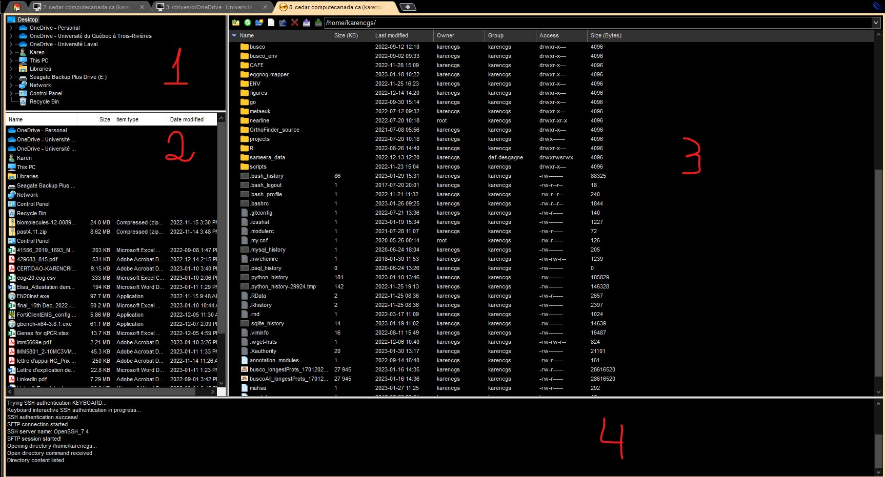

<style>
.code {
background-color: grey;
color: black
}

p, li {
line-height: 1em;
font-size: 0.75em
word-wrap: true
}
</style>

## Logging in {#slide1}

<center>
{width=60%}
</center>
- Click on `Session` -> `SSH`
- Add the `Remote Host` : cedar.computecanada.ca
- Click on `Specify username` then add yours
- Click OK: will ask your password (when you type, nothing will appear, but it is writing)

## Logging in {#slide2}

<center>
{width=60%}
</center>

- <span class="code">`ssh cedar.computecanada.ca`</span>
	- Will ask your user name then your password (what you type won't appear on the screen)
- <span class="code">`ssh YOUR_USERNAME@cedar.computecanada.ca`</span>
	- Replace `YOUR_USERNAME` with your username, in my case: `karencgs`
	- Will ask your password

## Server organization {#slide3}

- In the server, type (do not consider what comes after #):

### <b>
<div class="code">
```
pwd # after you log in, should be /home/username/
whoami # username
echo "$SCRATCH"
echo "$HOME"
ls $HOME/projects/
```
</div>
### </b>

- `$HOME` :  Store scripts, software files, things you use frequently without necessarily modifying them
- `$SCRATCH` : Use to run scripts, submit jobs (scripts that take too long or use a lot of resources)
- `/projects/` : Use as medium to long term storage (raw data, final results of analyses), share files with people of the same project
	- Check file authorizations so that other can use what you share

## Transfer files to server {#slide4}

<center>
{width=60%}
</center>

- In MobaxTerm, log in to the server, click on the left panel on the world button (SFTP)
- Left panel: buttons for upload, download, etc.
- Under the buttons is a bar to put the path to the desired folder
- Once you are in the folder you want, click on a file and click the button for download to select where you want to save it

## Transfer files to server {#slide5}

<center>
{width=60%}
</center>

- In MobaxTerm, create a SFTP session (like an SSH session)

## Transfer files to server {#slide6}

<center>
{width=60%}
</center>

1. Folders in your computer
2. Content of folder selected in panel 1
3. Folders in the server
4. Status of the connection and of transfers


## Transfer files to server {#slide7}

- `rsync` : transfer to and from server
	- To enter path to server, you need to add the log in info
	- Path to file(s) to transfer
	- Path to destination
	
### <b>
<div class="code">
```
rsync file_in_computer username@cedar.computecanada.ca:/home/username/
# Will ask for password to server
# copies file_in_computer to the server in the folder /home/username

rsync username@cedar.computecanada.ca:/home/username/file_in_server ./
# Will ask for password to server
# copies /home/username/file_in_server from the server my computer

```
</div>
### </b>

## Exercise - transfer fasta file {#slide8}

- Download the fasta file (sent to your email) to a folder of your choice in your computer
- Use `rsync` to transfer it to the server in a folder called `unix_class` in `$HOME`
- Edit the file with nano and remove two sequences, save to another file.
- Transfer new file to your computer using `rsync`


## Resources

- [How to connect to the server](https://docs.alliancecan.ca/wiki/SSH)
- [List of webinars (5-10min) on how to use the server](https://docs.alliancecan.ca/wiki/Getting_started_with_the_new_national_systems)
- [Types of folders in the server](https://docs.alliancecan.ca/wiki/Storage_and_file_management)
- [How to transfer data](https://docs.alliancecan.ca/wiki/Transferring_data)
